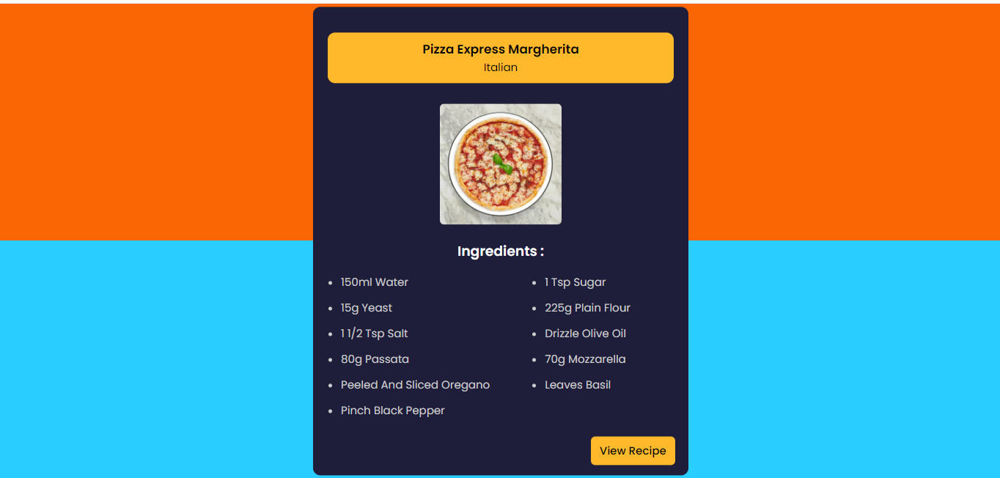

**Name:** MANIKANDAN.R  
**Company:** CODTECH IT SOLUTIONS  
**ID:**  
**Domain:** Frontend Development  
**Duration:**  

## Overview of the project

### Weather App
I am gonna showing to you how to work with recipe api in javascript. we create a responsive recipe guide app

### Technologies Used
1. HTML for markup
2. CSS for styling
3. JavaScript for Scripting and get the Meal DB API

# Screenshot
Here we have project screenshot :

